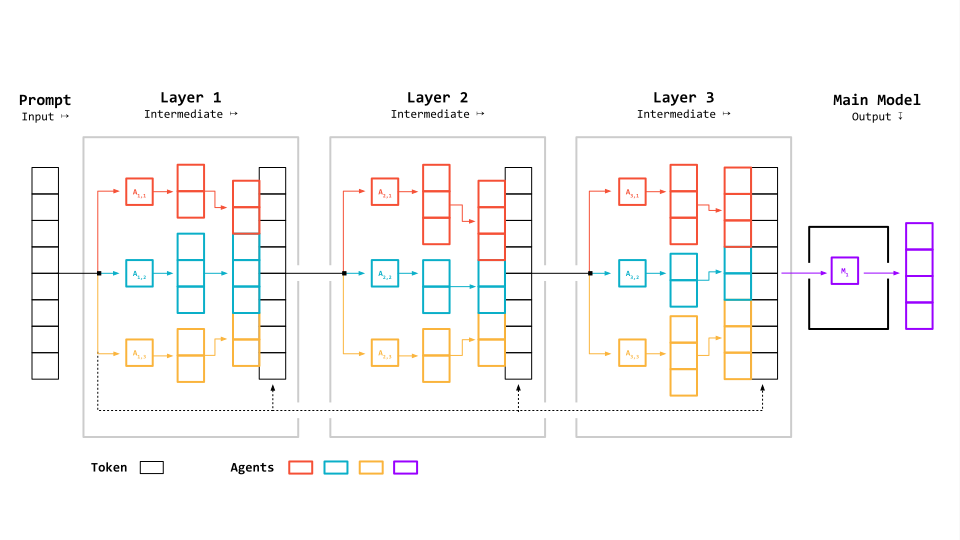
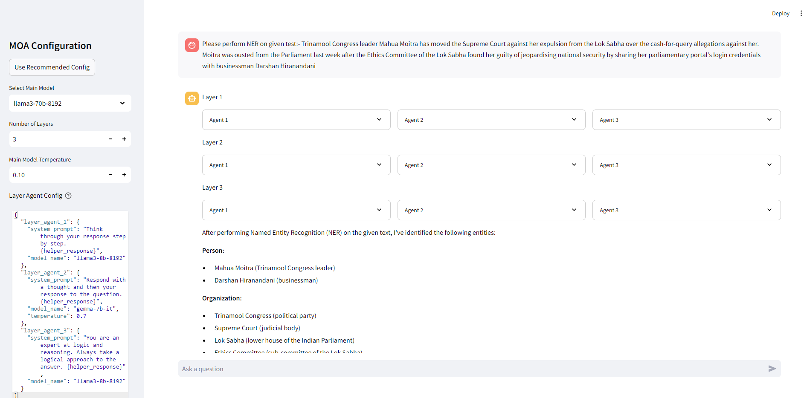

# Mixture-of-Agents Demo Powered by Groq

This Streamlit application showcases the Mixture of Agents (MOA) architecture proposed by Together AI, powered by Groq LLMs. It allows users to interact with a configurable multi-agent system for enhanced AI-driven conversations.


*Source: Adaptation of [Together AI Blog - Mixture of Agents](https://www.together.ai/blog/together-moa)*

## Features

- Interactive chat interface powered by MOA
- Configurable main model and layer agents
- Real-time streaming of responses
- Visualization of intermediate layer outputs
- Customizable agent parameters through the UI

## Installation

1. Clone the repository:
   ```
   git clone https://github.com/skapadia3214/groq-moa.git
   cd groq-moa
   ```

2. Install the required dependencies:
   ```
   pip install -r requirements.txt
   ```

3. Set up your environment variables:
   Create a `.env` file in the root directory and add your Groq API key:
   ```
   GROQ_API_KEY=your_api_key_here
   ```

## Usage

1. Run the Streamlit app:
   ```
   streamlit run app.py
   ```

2. Open your web browser and navigate to the URL provided by Streamlit (usually `http://localhost:8501`).

3. Use the sidebar to configure the MOA settings:
   - Select the main model
   - Set the number of cycles
   - Customize the layer agent configuration

4. Start chatting with the MOA system using the input box at the bottom of the page.

## Project Structure

- `app.py`: Main Streamlit application file
- `moa/`: Package containing the MOA implementation
  - `__init__.py`: Package initializer
  - `moa.py`: Core MOA agent implementation
  - `prompts.py`: System prompts for the agents
- `main.py`: CLI version of the MOA chat interface
- `requirements.txt`: List of Python dependencies
- `static/`: Directory for static assets (images, etc.)

## Configuration

The MOA system can be configured through the Streamlit UI or by modifying the default configuration in `app.py`. The main configurable parameters are:

- Main model: The primary language model used for generating final responses
- Number of cycles: How many times the layer agents are invoked before the main agent
- Layer agent configuration: A JSON object defining the system prompts, model names, and other parameters for each layer agent


For more information about the Mixture-of-Agents concept, please refer to the [original research paper](https://arxiv.org/abs/2406.04692) and the [Together AI blog post](https://www.together.ai/blog/together-moa).

## Output
